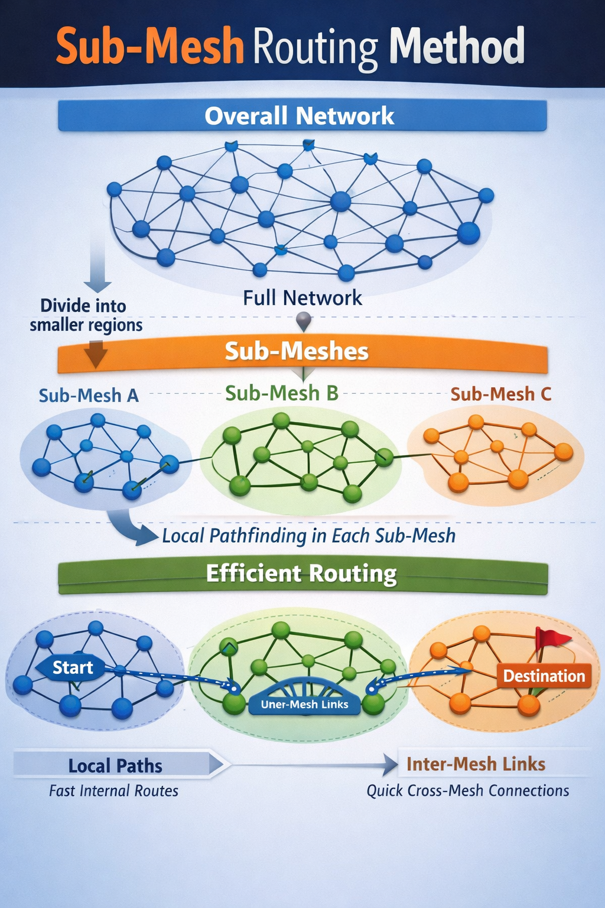

# SPARK
Foundational exploration of large-scale, user-operated radio mesh networks. SPARK defines early architecture for decentralized identity, sub-mesh formation, and probabilistic routing under real-world radio and adversarial constraints.

##Routing Methodology
The SPARK network uses a structured addressing system inspired by the modern internet, adapted for decentralized radio mesh environments. Nodes are assigned dynamic, ephemeral addresses derived from cryptographic identities, allowing routes to be formed and re-formed without exposing long-term node identity or location. This approach preserves user privacy while enabling efficient, directional packet routing across a constantly changing mesh.

